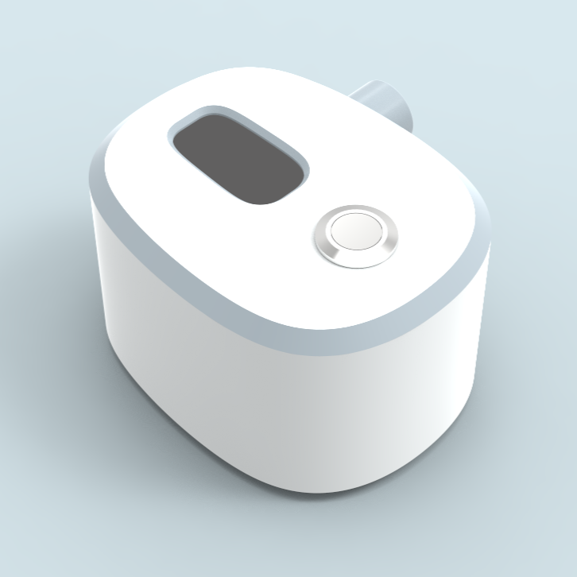
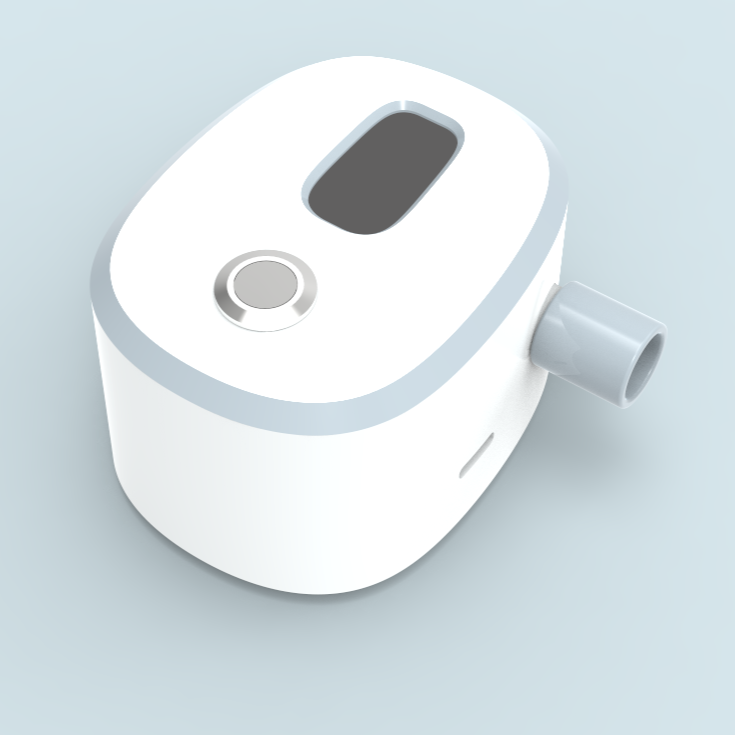

# Ketone Breath Analyzer (POC)

- [Ketone Breath Analyzer (POC)](#ketone-breath-analyzer-poc)
  - [Features](#features)
  - [Demo (Better Quality Videos in assets folder)](#demo-better-quality-videos-in-assets-folder)
    - [Baseline](#baseline)
    - [7 - Hours Fasted](#7---hours-fasted)
  - [Limitations](#limitations)
  - [Hardware](#hardware)
  - [Future Improvements](#future-improvements)

A proof-of-concept device for estimating breath acetone concentration as a non-invasive marker of ketosis.
Built with Arduino, a TGS1820 acetone gas sensor, and an OLED display.

   

## Features

- Measures acetone levels in breath (0–20 ppm range)
- Categorizes results into None, Light, Moderate, High, Very High ketosis states
- Custom interpolation logic (square root curve) based on calibration points
- Animated OLED UI (countdown, blow-out, processing, results)
- Battery indicator (placeholder) and simple progress bar feedback

## Demo (Better Quality Videos in assets folder)

### Baseline

### 7 - Hours Fasted

## Limitations

- No flow sensor → breath force impacts readings (variance up to ~20%)
- Limited calibration dataset (approximate, suitable for prototyping only)
- Intended for demonstration and educational use, not medical use

 

## Hardware

- Arduino
- TGS1820 acetone sensor
- SSD1306 OLED (128x64)

## Future Improvements

- Add flow sensor to normalize breath intensity
- Expand calibration dataset with controlled acetone concentrations
- Implement temperature and humidity compensation for sensor stability
- Optimize power management for portable use
